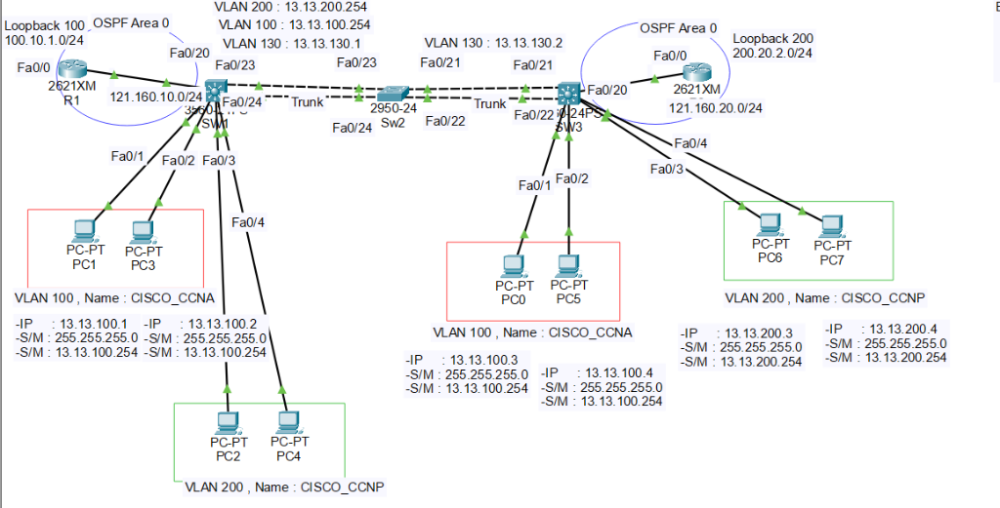

# 🏆 VLAN · EtherChannel · VTP · Inter-VLAN OSPF · NTP · Security 종합 실습

[](https://github.com/KSNAM97)
[](https://github.com/KSNAM97)
[](./LICENSE)

**L2 EtherChannel / VTP / STP · L3 SVI / Inter-VLAN · OSPF Routed-Interface · NTP(인증) · IP Fragment DoS 방어 종합 시험 (Cisco IOS / GNS3)**

> 개념 학습이 필요하면 아래 4개의 스터디 리포로 바로 이동하세요.
>
> - [📘 Part 1 · Cisco L2 Switch Study](https://github.com/KSNAM97/CISCO-SWITCH-L2STUDY)
> - [📗 Part 2 · Cisco L3 Switch Study](https://github.com/KSNAM97/Cisco-Switch-L3-Study)
> - [📙 Part 3 · Cisco Router L3 Study (NAT/DHCP/Telnet/SSH/NTP)](https://github.com/KSNAM97/CISCO-ROUTER-L3STUDY)
> - [📕 Part 4 · OSPF / ACL Multi-ISP Network](https://github.com/KSNAM97/OSPF-ACL-Multi-ISP-Network)

---


## 📖 About

| 항목 | 내용 |
| --- | --- |
| 주제 | VLAN · EtherChannel · VTP · STP · Inter-VLAN Routing · OSPF · NTP · IP Fragment DoS 방어 |
| 장비 구성 | R1 / R2 (Router), SW1 / SW3 (L3-Switch), SW2 (L2-Switch), PC1~PC8 |
| 핵심 기술 | L2 EtherChannel(PAgP/LACP), VTP(Server/Client), STP Root-Bridge, SVI, Inter-VLAN Routing, OSPF(Process 100 / Area 0), Routed-Interface, NTP 인증(Stratum), IP Fragment DoS 방어 |
| 시뮬레이터 | GNS3 / Cisco IOSvL2 / Packet Tracer |
| 검증 | `show etherchannel`, `show vtp status`, `show spanning-tree`, `show ip ospf neighbor`, `show ntp status` 등 |

---

## 🌐 토폴로지



```text
        Lo100 100.10.1.0/24                                              Lo200 200.20.2.0/24
        Lo211 211.241.228.0                                              
        OSPF Area0                                                       OSPF Area0
          [R1]                                                             [R2]
            |                                                               |
       121.160.10.0/24                                                 121.160.20.0/24
            |                                                               |
        [SW1 / L3] === VLAN130 (13.13.30.0/24) === [SW2 / L2] === [SW3 / L3]
            |                                                               |
       VLAN100/200                                                     VLAN100/200
   13.13.100.0/24 (CCNA)                                          13.13.100.0/24 (CCNA)
   13.13.200.0/24 (CCNP)                                          13.13.200.0/24 (CCNP)

```

## 📁 폴더 구조

```
VLAN-OSPF-NTP-Security-Study/
├── preconfig/          # 문제별 PreConfig 설정
├── verification/       # 문제별 검증 명령
├── topology/
│   └── topology.png
├── LICENSE
└── README.md
```

## 📝 실습 문제 (Exercises)

| # | 문제 | PreConfig | 검증 | 필요 지식 |
| --- | --- | --- | --- | --- |
| **EX1** | **L2 EtherChannel** — SW1↔SW2는 **PAgP**, SW2↔SW3는 **LACP**로 L2 EtherChannel 구성. 묶인 링크는 802.1Q Trunk로 연결 | [`ex1_l2-etherchannel.txt`](./preconfig/ex1_l2-etherchannel.txt) | [`ex1_verification.md`](./verification/ex1_verification.md) | [EtherChannel(PAgP/LACP)](https://github.com/KSNAM97/Cisco-Switch-L3-Study/blob/main/07_etherchannel/etherchannel.md) · [Trunk(802.1Q)](https://github.com/KSNAM97/CISCO-SWITCH-L2STUDY/blob/main/03_trunk/trunk.md) |
| **EX2** | **VTP** — SW1=Server, SW2·SW3=Client. Domain `ccnp` / Password `cisco1234`. VLAN은 SW1에서 생성, SW1이 Root-Bridge | [`ex2_vtp.txt`](./preconfig/ex2_vtp.txt) | [`ex2_verification.md`](./verification/ex2_verification.md) | [VTP](https://github.com/KSNAM97/CISCO-SWITCH-L2STUDY/blob/main/04_vtp/vtp.md) · [STP](https://github.com/KSNAM97/CISCO-SWITCH-L2STUDY/blob/main/05_stp/stp.md) |
| **EX3** | **VLAN Access / PortFast** — SW1·SW3에 VLAN 100·200 Access 포트 설정. PC 포트는 지연 없이 즉시 Forwarding | [`ex3_vlan-access-portfast.txt`](./preconfig/ex3_vlan-access-portfast.txt) | [`ex3_verification.md`](./verification/ex3_verification.md) | [VLAN](https://github.com/KSNAM97/CISCO-SWITCH-L2STUDY/blob/main/02_vlan/vlan.md) · [PortFast](https://github.com/KSNAM97/CISCO-SWITCH-L2STUDY/blob/main/07_portfast/portfast.md) |
| **EX4** | **PC IP / DNS / Gateway** — VLAN100=13.13.100.0/24, VLAN200=13.13.200.0/24. Gateway=SVI, DNS `168.126.63.1`, 임대 5일 (DHCP) | [`ex4_pc-ip-dns.txt`](./preconfig/ex4_pc-ip-dns.txt) | [`ex4_verification.md`](./verification/ex4_verification.md) | [DHCP](https://github.com/KSNAM97/CISCO-ROUTER-L3STUDY/blob/main/02_dhcp/dhcp.md) · [SVI](https://github.com/KSNAM97/Cisco-Switch-L3-Study/blob/main/03_svi/svi.md) · [Inter-VLAN](https://github.com/KSNAM97/Cisco-Switch-L3-Study/blob/main/04_inter-vlan/inter-vlan.md) |
| **EX5** | **Loopback / Routed-Interface / SVI** — R1 Lo100 `100.10.1.1/24`, R2 Lo200 `200.20.2.2/24`, R1 Lo211 `211.241.228.2/24`. R1↔SW1 `121.160.10.0/24`, R2↔SW3 `121.160.20.0/24` Routed-Interface. **SVI**로 VLAN130 연동 | [`ex5_loopback-routed-svi.txt`](./preconfig/ex5_loopback-routed-svi.txt) | [`ex5_verification.md`](./verification/ex5_verification.md) | [Routed Port](https://github.com/KSNAM97/Cisco-Switch-L3-Study/blob/main/02_routed-port/routed-port.md) · [SVI](https://github.com/KSNAM97/Cisco-Switch-L3-Study/blob/main/03_svi/svi.md) · [L3 Switch Basics](https://github.com/KSNAM97/Cisco-Switch-L3-Study/blob/main/01_l3-switch-basics/l3-switch-basics.md) |
| **EX6** | **OSPF** — Process 100 / Area 0. R1·R2 Routed-Interface, SW1·SW3 SVI(VLAN130), Lo100·Lo200·Lo211 포함. Router-ID 고정 | [`ex6_ospf.txt`](./preconfig/ex6_ospf.txt) | [`ex6_verification.md`](./verification/ex6_verification.md) | [OSPF(L3)](https://github.com/KSNAM97/Cisco-Switch-L3-Study/blob/main/06_ospf/ospf.md) · [OSPF 이론](https://github.com/KSNAM97/OSPF-ACL-Multi-ISP-Network/blob/main/docs/01-ospf-theory.md) · [Neighbor State](https://github.com/KSNAM97/OSPF-ACL-Multi-ISP-Network/blob/main/docs/03-ospf-neighbor-state.md) |
| **EX7** | **NTP** — R2=NTP Server(stratum 2), SW1·R1=Client(R2 동기화). R2에 NTP **인증** 적용. Client 동기화 후 **Stratum 3** 확인 | [`ex7_ntp.txt`](./preconfig/ex7_ntp.txt) | [`ex7_verification.md`](./verification/ex7_verification.md) | [NTP](https://github.com/KSNAM97/CISCO-ROUTER-L3STUDY/blob/main/05_ntp/ntp.md) |
| **EX8** | **IP Fragment DoS 방어** — R1=NTP Server(100.10.1.1). 외부로부터의 IP Fragment 기반 DoS 공격 시 단편 패킷이 처리되지 않도록 ACL로 차단 | [`ex8_dos-defense.txt`](./preconfig/ex8_dos-defense.txt) | [`ex8_verification.md`](./verification/ex8_verification.md) | [ACL 이론](https://github.com/KSNAM97/OSPF-ACL-Multi-ISP-Network/blob/main/docs/08-acl-theory.md) · [NTP](https://github.com/KSNAM97/CISCO-ROUTER-L3STUDY/blob/main/05_ntp/ntp.md) |

> 각 문제는 `preconfig/*.txt` 를 콘솔에 붙여넣어 구성한 뒤, `verification/*.md` 로 결과를 확인합니다.

---

## 📜 License

[MIT License](./LICENSE)
